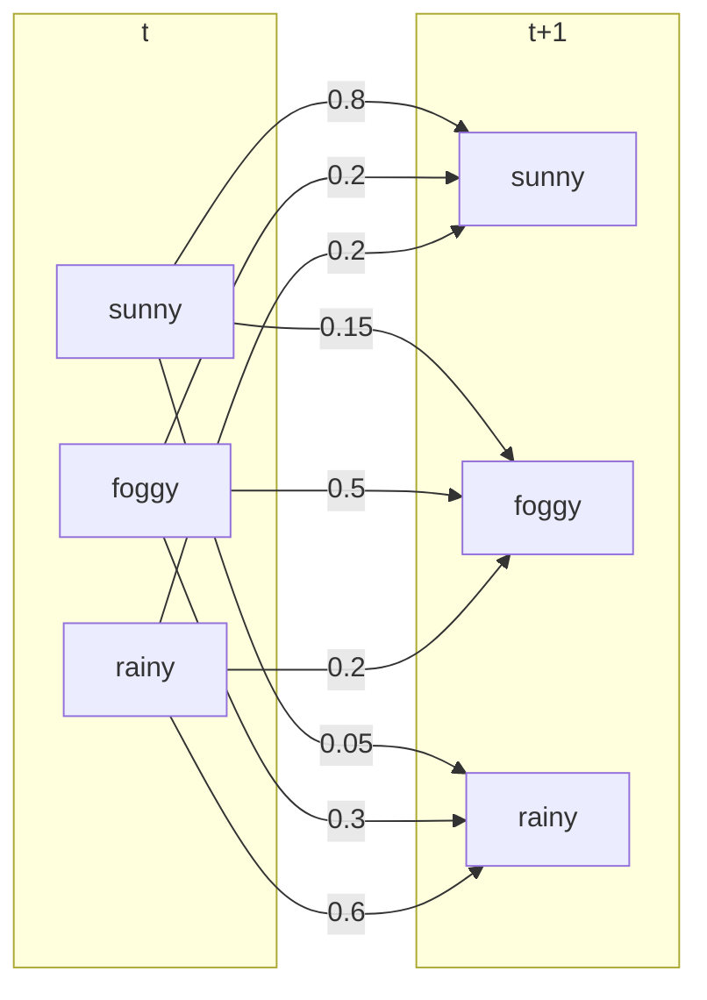

# Homework 3: Viterbi Algorithm

>   Practice/Real-Life Applications of Computational Algorithms, Spring 2021

## Execution

```bash
make
./viterbi [input file] [output file]
```

## Implementation

-   Since the weather is a markov model, we can use Viterbi algorithm.
-   To avoid floating-point precision error of multiplication, I use `log()` to calculate with addition and maximum.
-   For backtracking, I record the transition state of each state.



